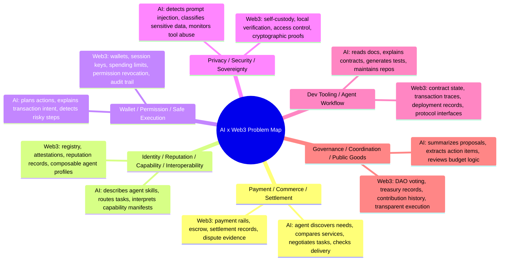

# Week 2 Module A: AI x Web3 Problem Map

Status: ready to submit.

## Draft

这次 Module A 的目标不是马上确定一个完整项目，而是先把 AI x Web3 的问题空间铺开，再选择一个可以继续深入拆解的主线。

我把 AI x Web3 的交叉点理解为：AI 负责理解、规划、生成、判断和调用工具；Web3 负责身份、权限、资金、状态、规则执行和可验证记录。一个方向是否成立，不取决于它用了多少新概念，而取决于 AI 能力和 Web3 机制是否同时不可替代。

## Problem Map

## Direction Notes

| Direction | Real user | AI role | Web3 mechanism | Likely output |
|---|---|---|---|---|
| Payment / Commerce / Settlement | Agents, API providers, data providers, builders buying services | Match demand and supply, compare offers, verify task completion, prepare settlement context | Stablecoin payment, escrow, payment receipts, dispute records | Product demo or protocol flow |
| Identity / Reputation / Capability / Interoperability | Agent developers, users choosing agents, platforms listing agents | Convert natural-language abilities into structured capability profiles and routing logic | Registry, attestations, reputation, agent profile standards | Standard memo or registry prototype |
| Wallet / Permission / Safe Execution | Wallet users, agent app users, compliance teams, Safe/account abstraction builders | Explain wallet actions, detect unsafe permissions, recommend human review points | Wallet policies, session keys, spending caps, revocation, audit logs | Risk model or guarded wallet workflow |
| Privacy / Security / Sovereignty | Users connecting agents to tools, teams handling sensitive data | Detect prompt injection, classify sensitive data, block unsafe tool calls | Self-custody, permission boundaries, encrypted/local execution, verifiable controls | Security checklist or local-first demo |
| Dev Tooling / Agent Workflow | Web3 builders, hackathon teams, non-technical learners | Read docs, explain contracts, create tests, turn notes into repos and demos | On-chain data, contract ABI, transaction logs, deployment records | Developer tool or learning workflow |
| Governance / Coordination / Public Goods | DAO contributors, grantees, public-goods teams, reviewers | Summarize proposals, track commitments, identify unclear budget or execution items | Voting records, treasury flows, contribution attestations, public audit trail | Governance assistant or research memo |

## Two Direction Checks

### 1. Wallet / Permission / Safe Execution

Why it is not a pure AI problem:

AI can understand user intent, explain transaction risk, and suggest safer action boundaries, but it cannot by itself enforce wallet permissions, spending limits, revocation, or transaction-level control. Once an agent touches signing, transfers, or delegated execution, the problem becomes operational and economic, not just linguistic.

Why it is not a pure Web3 problem:

Web3 wallets can enforce rules, but users often do not understand what a transaction, approval, session key, or delegated permission actually means. Without AI, the permission layer is hard to interpret and hard to adapt to real user context. AI is useful as the explanation, classification, and policy-assistance layer before execution.

### 2. Payment / Commerce / Settlement

Why it is not a pure AI problem:

AI agents can search, negotiate, compare vendors, and check whether a task appears complete, but they still need a settlement mechanism. If payment, escrow, receipts, and dispute evidence only live inside a centralized database, then the system depends on a trusted platform rather than an open agent economy.

Why it is not a pure Web3 problem:

Web3 can move value and record settlement, but it does not solve task interpretation, service matching, quality checking, or natural-language negotiation by itself. AI is needed to turn messy commercial intent into structured tasks, acceptance criteria, and execution steps.

## Week 2 Main Line

My Week 2 main line will be:

**Wallet / Permission / Safe Execution for Programmable Compliance.**

The reason is that this direction sits directly at the intersection of machine execution, economic exchange, permission control, and verifiable records. It also matches my longer-term thesis of Programmable Compliance / 可编程合规: compliance should be designed into the product and protocol workflow before high-impact actions happen, instead of being treated only as after-the-fact legal remediation.

## Minimum Week 2 Exploration

Target user:

An AI-agent app user, wallet user, or compliance/product operator who wants to let an agent help with Web3 actions without giving it unlimited authority.

Real scenario:

A user asks an AI agent to help analyze, prepare, or partially execute a Web3 transaction flow. Before anything is signed or submitted, the system should explain what the action does, classify the risk, check whether it exceeds the user's allowed budget or permission scope, and decide whether human confirmation is required.

Minimum function:

- Describe the requested wallet or transaction action in plain language.
- Classify whether it involves funds, signing, approval, identity, sensitive data, or governance power.
- Apply a simple permission policy such as "read-only allowed, draft transaction allowed, signing requires confirmation, unlimited approval blocked."
- Produce an auditable note: requested action, risk category, decision, and reason.

Validation method:

- A flow diagram showing the agent-to-wallet permission path.
- A small policy table covering read-only, draft, limited transfer, approval, and high-risk actions.
- Example logs showing what the system would allow, pause, or block.
- Manual review of edge cases involving private keys, unlimited approvals, real funds, or sensitive user data.

Risk boundary:

This exploration should not use real private keys, seed phrases, API keys, real funds, or production wallet accounts. The Week 2 output should stay at the level of problem map, flow design, mock policy, and public-safe examples.

## Backlog Directions

- Payment / Commerce / Settlement can become a later Agentic Commerce flow once the permission layer is clearer.
- Privacy / Security / Sovereignty is closely related and can provide the safety checklist for prompt injection, tool abuse, and sensitive-data handling.
- Governance / Coordination / Public Goods can become a later use case for proposal review and transparent execution, but it is less urgent for my Week 2 main line.

## Public Proof

- Learning repo: https://github.com/alexfanzong/ai-web3-school-cohort-0
- Local note: `submissions/2026-05-28-week2-module-a-ai-web3-map.md`
