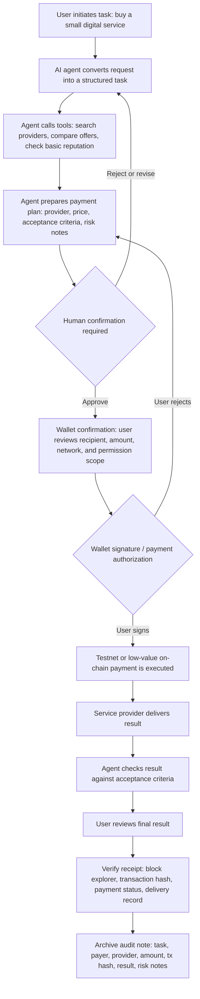

# Minimal AI x Web3 Workflow

Status: ready to submit.

## Submission

This workflow uses a simple payment scenario to help me understand the boundary between an AI system and on-chain execution.

Scenario:

An AI agent helps a user purchase a small digital service, such as an API query, data lookup, code review, or document analysis. The agent can prepare the task and payment request, but the user must confirm before any wallet signing or on-chain payment happens.

## Workflow Diagram

## Boundary Table

| Step | Who initiates? | Who executes? | Human confirmation? | Wallet / payment / authorization? | Verification method | Main risk point |
|---|---|---|---|---|---|---|
| User requests a digital service | User | User | Yes, at task definition level | No | The task is written in plain language | The request may be vague or too broad |
| AI structures the task | User starts it, AI continues | AI agent | Not yet, unless task scope changes | No | User can read the structured task | AI may misunderstand user intent |
| Agent compares providers | AI agent | AI agent and external tools | Not yet | No | Provider list, offer details, visible reputation signals | Tool output may be outdated, biased, or manipulated |
| Agent prepares payment plan | AI agent | AI agent | Yes, before payment | No | Price, recipient, task scope, acceptance criteria, and risk notes are shown to the user | Agent may recommend an unsafe provider or unclear payment condition |
| User confirms payment intent | User | User | Mandatory | Not yet signed, but payment intent is approved | User reviews amount, recipient, network, and reason | User may approve without understanding the risk |
| Wallet signs transaction | User | Wallet and blockchain network | Mandatory | Yes: wallet signature and payment authorization | Wallet confirmation screen and transaction preview | Wrong recipient, wrong chain, unlimited approval, phishing, or signing a different action |
| On-chain payment executes | User-authorized wallet action | Blockchain network / smart contract | Already confirmed before execution | Yes: payment is submitted | Transaction hash and block explorer status | Failed transaction, gas cost, front-running, or irreversible payment |
| Provider delivers result | Provider | Provider | User reviews after delivery | No new payment unless milestone flow is used | Output file, API response, service result, or delivery log | Low-quality or fake delivery |
| Agent checks delivery | User-approved workflow | AI agent | Human review still required for final acceptance | No | Compare result against acceptance criteria | AI may incorrectly judge quality or miss hidden problems |
| Receipt and audit note are archived | User or workflow system | Agent prepares note, user keeps record | Optional final review | No new signature | Transaction hash, block explorer, payment status, delivery record | Missing records make later dispute difficult |

## Required Human Confirmation Points

The AI agent may assist, but it should not independently perform these steps:

- approving the final payment plan;
- signing a wallet transaction;
- granting token approval or session-key permission;
- accepting a high-risk or unclear provider;
- marking disputed work as complete;
- increasing the budget or changing the recipient address.

## Wallet / Payment / Authorization Points

The workflow has one clear signing point:

**Wallet confirmation before on-chain payment.**

At that point, the user should review:

- recipient address;
- payment amount;
- token and network;
- whether the action is a simple transfer, approval, escrow deposit, or contract interaction;
- whether any permission is reusable or revocable;
- whether the action is on testnet, low-value mainnet, or a production account.

For a learning exercise, this should stay on testnet or use mock records. No private keys, seed phrases, API keys, or real funds should be used.

## Result Verification

The result can be verified through three layers:

1. On-chain verification: transaction hash, block explorer status, sender, recipient, token, amount, timestamp, and contract interaction.
2. Service verification: delivered output, API response, file, or task result compared with the acceptance criteria.
3. Workflow verification: audit note showing who requested the task, what the agent recommended, when the user confirmed, what was signed, and how the result was checked.

## Risk Points

| Risk | Why it matters | Possible guardrail |
|---|---|---|
| Prompt injection | A provider page or tool result may try to manipulate the agent | Treat external content as data, not instructions |
| Wrong recipient | Payment may go to the wrong address | Require human review and address display before signing |
| Hidden approval | A transaction may grant more permission than expected | Explain whether the action is transfer, approval, or contract call |
| Overpayment | Agent may choose an expensive provider or wrong amount | Set a budget limit before tool calls or payment |
| Fake delivery | Provider may submit low-quality or irrelevant output | Define acceptance criteria before payment |
| Weak verification | On-chain payment alone does not prove service quality | Verify both transaction record and delivered result |
| Irreversible execution | Blockchain payments may be hard to reverse | Use testnet, escrow, milestone payment, or low-value limits |
| Privacy leak | Agent may send sensitive user data to external tools | Minimize input data and classify sensitive content before tool calls |

## Final Takeaway

The most important boundary is that the AI agent can prepare and explain an action, but the user must remain responsible for signing, payment authorization, and final acceptance.

For my Payment / Commerce / Settlement direction, the minimum safe pattern is:

**AI prepares the task and payment context -> human reviews -> wallet confirms -> chain executes -> receipt and delivery are verified.**

This shows why AI x Web3 is not just automation. It is about designing a workflow where machine assistance, human judgment, wallet authorization, and verifiable records each have a clear role.

## Public Proof

- Learning repo: https://github.com/alexfanzong/ai-web3-school-cohort-0
- Local note: `submissions/2026-05-29-minimal-ai-web3-workflow.md`
