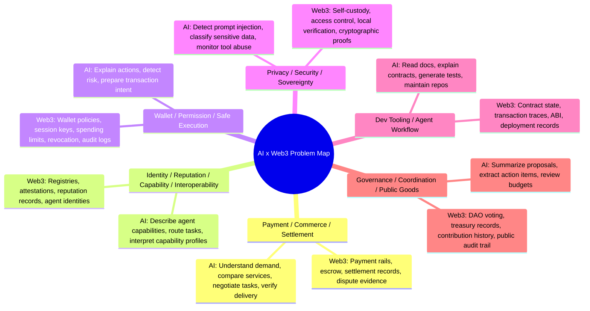

# Week 2 Module A: AI x Web3 Problem Map

Status: ready to submit.

## Submission

The goal of Module A is to map the broader AI x Web3 problem space before choosing one direction for deeper Week 2 exploration.

My current understanding is that a meaningful AI x Web3 direction should not rely on new terminology alone. It should show why AI capabilities and Web3 mechanisms are both necessary. AI is strong at understanding intent, planning actions, comparing options, using tools, and turning messy information into structured decisions. Web3 is strong at payments, permissions, identity, settlement, verifiable records, and open coordination.

The most valuable problems usually appear where machine execution, economic exchange, permission control, and verifiable records meet.

## Problem Map

## Direction Overview

| Direction | Real user | AI role | Web3 mechanism | Possible output |
|---|---|---|---|---|
| Payment / Commerce / Settlement | AI agents, API providers, data providers, compute providers, service marketplaces | Understand what the buyer wants, compare vendors, turn tasks into acceptance criteria, check whether work was delivered | Stablecoin payment, escrow, receipts, settlement records, dispute evidence | Product demo, payment flow, protocol memo |
| Identity / Reputation / Capability / Interoperability | Agent developers, users choosing agents, platforms listing agents | Translate agent abilities into structured capability profiles and match tasks to agents | Agent registries, attestations, reputation records, verifiable profiles | Registry mock or standard memo |
| Wallet / Permission / Safe Execution | Wallet users, agent app users, compliance/product operators | Explain actions, classify risk, decide when human confirmation is needed | Smart accounts, session keys, limits, revocation, audit logs | Guarded wallet workflow or risk model |
| Privacy / Security / Sovereignty | Users connecting agents to tools, teams handling sensitive data | Detect prompt injection, prevent unsafe tool use, classify private data | Self-custody, local execution, access controls, proofs | Security checklist or local-first demo |
| Dev Tooling / Agent Workflow | Web3 builders, hackathon teams, non-technical learners | Read docs, explain transactions, generate code/tests, organize repos | On-chain data, contract interfaces, transaction logs, deployment records | Developer tool or learning workflow |
| Governance / Coordination / Public Goods | DAO contributors, grant reviewers, public-goods teams | Summarize proposals, track commitments, flag unclear budgets | Voting records, treasury flows, contribution attestations | Governance assistant or research memo |

## Two Direction Checks

### 1. Payment / Commerce / Settlement

Why it is not a pure AI problem:

AI can understand a user's commercial intent, compare service providers, draft a task description, and check whether a result appears complete. But AI alone does not provide payment, escrow, settlement, receipts, or an open record of what happened. If an agent buys data, API access, compute, or a service, the system still needs a way to move value and record the transaction.

Without Web3, the payment and settlement layer would usually depend on a closed platform or a trusted intermediary. That makes it harder for independent agents, builders, and service providers to transact across platforms.

Why it is not a pure Web3 problem:

Web3 can move money and record settlement, but it does not understand natural-language requests, service quality, delivery conditions, or buyer preferences by itself. A smart contract can hold funds, but it cannot easily decide whether "summarize this report," "run this data analysis," or "provide this API result" has been completed correctly without additional interpretation.

AI is needed to turn messy commercial requests into structured tasks, compare options, monitor delivery, and produce evidence for acceptance or dispute.

### 2. Wallet / Permission / Safe Execution

Why it is not a pure AI problem:

AI can explain a transaction and identify risky actions, but it cannot by itself enforce wallet limits, revoke permissions, or prevent unauthorized signing. When agents touch money or approvals, the problem requires enforceable wallet and permission infrastructure.

Why it is not a pure Web3 problem:

Wallets can enforce rules, but users often do not understand transaction details, approvals, session keys, or delegated permissions. AI can help translate technical actions into user-readable explanations and recommend when human confirmation is necessary.

## Week 2 Main Direction

My Week 2 main direction will be:

**Payment / Commerce / Settlement for AI agents.**

I choose this direction because AI agents are becoming better at performing work, but useful work also needs a commercial loop: request, quote, acceptance criteria, execution, verification, payment, receipt, and dispute handling. This is where AI and Web3 both matter.

The key question is:

**How can an AI agent safely buy or sell digital services such as API access, data, compute, research, or workflow execution with clear payment, verification, and settlement records?**

## Minimum Week 2 Exploration

Target user:

An AI agent builder, API/data provider, or workflow platform that wants agents to buy and sell digital services without relying entirely on a centralized marketplace.

Real scenario:

An agent needs to purchase a small digital service, such as API access, data lookup, code review, document analysis, or compute time. Before payment happens, the agent should understand the offer, check the price, define the expected result, and make sure payment only happens under clear conditions.

Minimum function:

- Turn a user request into a structured task.
- Compare at least two possible service providers or offers.
- Define acceptance criteria before payment.
- Choose a payment mode, such as pay-before-use, escrow, milestone payment, or pay-after-verification.
- Generate a simple settlement record: task, provider, price, result, payment status, and dispute notes.

Validation method:

- A flow diagram showing request -> quote -> acceptance criteria -> execution -> verification -> settlement.
- A table comparing payment models: prepaid, escrow, milestone, and postpaid.
- Mock logs showing how an agent decides whether to pay, pause, or dispute.
- Public-safe examples with no private keys, real funds, API keys, or production accounts.

Risk boundary:

This exploration should not involve real wallet signing, real private keys, seed phrases, API keys, production accounts, or real funds. The Week 2 work should stay at the level of problem map, payment-flow design, mock settlement records, and public-safe examples.

## Why This Fits My Longer-Term Learning Direction

This direction connects naturally with Programmable Compliance / 可编程合规. If agents can buy services, move value, and trigger settlement, then compliance cannot be added only after something goes wrong. The product needs clear rules before execution:

- What is the agent allowed to buy?
- What budget can it use?
- What evidence is required before payment?
- When must a human approve?
- What record should remain after the transaction?
- What happens if the result is wrong, unsafe, or disputed?

In this sense, Payment / Commerce / Settlement is not only about payment. It is also about designing accountable economic behavior for AI agents.

## Backlog Directions

- Wallet / Permission / Safe Execution should become the permission layer for agent payments.
- Privacy / Security / Sovereignty should become the safety layer for external tools, sensitive data, and prompt injection.
- Identity / Reputation / Capability / Interoperability can support agent discovery and provider trust.

## Public Proof

- Learning repo: https://github.com/alexfanzong/ai-web3-school-cohort-0
- Local note: `submissions/2026-05-29-week2-module-a-payment-map.md`
