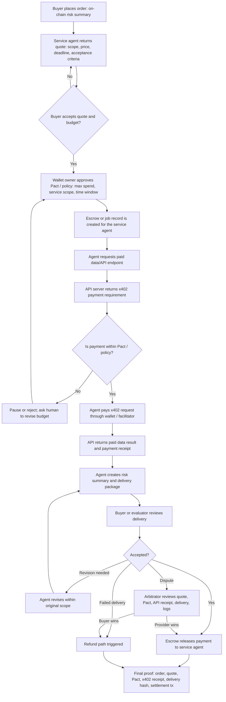

# Week 2 Module B: Agent Payment / Commerce Flow

Status: ready to submit.

## Submission

This note designs a minimal payment / commerce flow for an agent that helps a user complete a task and gets paid. I focus on a small digital-service scenario because it shows the real boundary of agent commerce: the hard part is not only sending money, but connecting quote, budget authorization, execution, delivery, acceptance, payment, refund, dispute, and proof of record.

## Scenario

A user orders a small on-chain risk summary from an AI service agent.

Task:

**"Analyze this wallet address or transaction and return a plain-language risk summary."**

The service agent may need to call a paid data API behind an x402 paywall. The user's wallet uses a Cobo Agentic Wallet-style Pact to limit what the agent can spend, which services it can call, and how long the authorization lasts.

This scenario has two payment layers:

1. The buyer pays the service agent for the final risk-summary task.
2. The service agent may pay a data/API provider during execution, but only within the buyer-approved budget and policy.

## Roles

| Question | Answer in this scenario |
|---|---|
| Who places the order? | The buyer / client, usually a human user. |
| Who executes the task? | The service agent executes the workflow and may call an x402-protected data API. |
| Who accepts the result? | The buyer accepts the final report; for higher-risk work, a human evaluator or trusted evaluator agent can help review it. |
| Who pays? | The buyer funds the task budget; the wallet owner authorizes spending through wallet confirmation or Pact policy. |
| Who receives payment? | The service agent receives payment after acceptance; the external API provider receives payment for the paid data call. |
| Who arbitrates? | A platform operator, human reviewer, DAO committee, or predefined evaluator rule handles disputes. |

## Minimal Flow

## Step-by-Step Commerce Design

| Step | What happens | Actor | Required control or proof |
|---|---|---|---|
| 1. Order | Buyer asks for a wallet / transaction risk summary | Buyer | Task must be specific enough to price and evaluate |
| 2. Quote | Agent returns price, deadline, data assumptions, and deliverable format | Service agent | Quote must be shown before authorization |
| 3. Budget authorization | Buyer approves maximum spend and policy limits | Buyer / wallet owner | Human confirmation before funds or permissions are granted |
| 4. Pact / policy setup | Wallet limits budget, allowed API provider, chain, contract, and time window | Wallet owner / CAW-style wallet | Agent cannot exceed the approved boundary |
| 5. Job funding | Payment is escrowed or a job record is created | Payment layer | Budget, payer, provider, deadline, and status are recorded |
| 6. Execution | Agent calls the paid data provider | Service agent | Tool call must stay within policy and avoid sensitive data leakage |
| 7. x402 payment | API returns a payment requirement; agent pays if within policy | Agent + wallet / facilitator | Payment request, signature, settlement, and receipt |
| 8. Delivery | Agent returns summary, data source notes, and evidence | Service agent | Delivery is linked to the original order and API receipt |
| 9. Acceptance | Buyer or evaluator checks result against criteria | Buyer / evaluator | Human review for subjective or high-risk conclusions |
| 10. Payment / refund / dispute | Accepted work is paid; failed work is refunded or disputed | Payment layer / arbitrator | Clear status transition and final record |
| 11. Record proof | Store quote, policy, API receipt, delivery hash, acceptance, and settlement | Workflow system / payment layer | Later audit, dispute, and accountability |

## Quote

The quote should be structured.

| Field | Example |
|---|---|
| Task | Analyze one wallet address or transaction and summarize visible risk signals |
| Price to buyer | 3 USDC or testnet equivalent |
| External API budget | Up to 0.5 USDC for one paid risk-data API call |
| Deadline | 30 minutes |
| Deliverable | Plain-language risk summary with 3-5 bullet points and source notes |
| Acceptance criteria | Output mentions obvious risk flags, no fabricated certainty, and includes the API receipt / evidence reference |
| Exclusions | Not legal advice, not formal audit, not investment advice, not production compliance approval |
| Failure condition | No delivery, unrelated output, missing receipt, exceeded budget, or fabricated evidence |

## Budget Authorization / Pact

The agent should not receive a broad "can pay" permission. A safer Pact / policy should include:

- maximum total spend: 3 USDC for the task;
- maximum external API spend: 0.5 USDC;
- allowed provider: one selected x402-protected API endpoint;
- allowed operation: one paid API request and one final delivery;
- time window: 30 minutes;
- no reusable unlimited token approval;
- no private keys, seed phrases, API keys, or production credentials;
- pause if the agent asks for more budget, a different provider, a new chain, or a new contract interaction;
- audit log for allowed, denied, and paused actions.

This is where Cobo Agentic Wallet is relevant as a case study: CAW's Pact model is designed to define what an agent is allowed to do, under which rules, and when that authority ends. Its value in this flow is budget control, permission enforcement, revocation, and audit records. It does not by itself solve quote negotiation, delivery quality, evaluator logic, or dispute resolution.

## Payment / Refund / Dispute Rules

| Outcome | Condition | Result |
|---|---|---|
| Payment to service agent | Buyer or evaluator accepts the risk summary | Escrow releases final task payment |
| Payment to API provider | x402 payment requirement is within Pact and request succeeds | Agent pays API provider and stores receipt |
| Revision | Delivery is incomplete but still within original scope | Agent gets one revision window |
| Refund | Agent misses deadline, exceeds policy, fabricates evidence, or delivers unrelated output | Buyer receives refund |
| Dispute | Buyer and agent disagree about quality or scope | Arbitrator reviews quote, Pact, API receipt, delivery, logs, and settlement record |
| Partial payment | Work is useful but incomplete | Partial release or partial refund according to predefined rule |

## Record Proof

The final record should prove more than "money moved." It should connect payment to task context and delivery.

Minimum proof package:

- order ID;
- buyer account or wallet address;
- service agent ID or wallet address;
- external API provider endpoint or provider ID;
- quote and accepted budget;
- Pact / policy summary;
- x402 payment receipt or settlement reference;
- delivery hash or file link;
- evaluator decision;
- final payment / refund / dispute status;
- transaction hash or escrow event;
- timestamp.

Sensitive inputs should not be written directly on-chain. For private data, the record should use hashes, encrypted references, or short non-sensitive summaries.

## Risk Points

| Risk | Where it appears | Guardrail |
|---|---|---|
| Vague task scope | Order and quote | Require structured quote and acceptance criteria |
| Overpayment | Budget authorization | Set task budget, external API budget, and failure stop conditions |
| Policy bypass | Execution | Check every paid call against Pact / policy before signing |
| Unsafe wallet approval | Payment setup | Avoid unlimited approval; prefer single payment, escrow, or narrow policy |
| Prompt injection | API or external content | Treat external content as untrusted data |
| Fake delivery | Delivery | Require source notes, delivery hash, and evaluator review |
| AI hallucination | Risk summary | State uncertainty and avoid pretending legal / audit certainty |
| Weak dispute evidence | Dispute | Keep quote, Pact, logs, receipts, delivery, and decision record |
| Privacy leak | Tool call | Minimize input data and avoid sending sensitive wallet/user data unless necessary |
| Irreversible payment | Settlement | Use testnet, low value, escrow, or milestone release for prototypes |

## Protocol Comparison

I compare **x402**, **MPP**, and **ERC-8183** because they sit at different parts of the payment / commerce stack.

| Protocol / standard | Best fit | Solves which part? | Does not fully solve |
|---|---|---|---|
| x402 | HTTP-native paid API or content access | Payment request, signed payment payload, verification, settlement, and paid resource delivery | Full job escrow, subjective acceptance, reputation, or arbitration |
| MPP | Machine-to-machine payments for API requests, tool calls, or content | Pay-per-request framing for agents and apps paying during the same HTTP call | Full escrow, evaluator, dispute, or service-quality judgment |
| ERC-8183 | Agent commerce jobs with escrow and evaluator attestation | Job state, funded budget, provider submission, evaluator completion / rejection, expiry, refund, and settlement | Service discovery, detailed reputation, or subjective off-chain evaluation by itself |

### Where x402 fits

x402 fits the paid API part of the flow. The agent requests a protected API endpoint, receives an HTTP 402 payment requirement, submits a signed payment payload, and receives the resource after verification and settlement. It is strong for small, automatic, API-style purchases.

### Where MPP fits

MPP is also relevant to machine-to-machine payments. Its framing is useful when agents or apps pay for API requests, tool calls, or content per request. In this flow, MPP would sit near the same layer as x402: service access and machine-readable payment.

### Where ERC-8183 fits

ERC-8183 fits the larger commerce-state layer. It is useful when the job needs escrow, provider submission, evaluator acceptance or rejection, expiry, refund, and final settlement. In this flow, ERC-8183 is closer to the buyer-to-service-agent contract, while x402 / MPP are closer to the service-agent-to-API-provider payment.

## Final Takeaway

The complete minimum flow is:

**order -> quote -> budget authorization -> Pact / policy -> execution -> delivery -> acceptance -> payment / refund / dispute -> record proof.**

My current judgment:

- x402 and MPP are strong for small machine payments and API-style access;
- ERC-8183 is stronger for job escrow, evaluator decisions, refunds, and settlement;
- Cobo CAW / Pact is important for wallet-side budget control, permission boundaries, and audit logs;
- none of these alone solves the entire commerce problem.

Agent commerce becomes meaningful when an agent can act economically, but only inside clear authorization, budget, verification, and accountability boundaries.

## References

- AI x Web3 School Agentic Commerce: https://aiweb3.school/zh/handbook/tracks/agentic-commerce/
- x402 docs: https://docs.cdp.coinbase.com/x402/core-concepts/how-it-works
- MPP: https://mpp.dev/
- ERC-8183: https://eips.ethereum.org/EIPS/eip-8183
- Cobo Agentic Wallet introduction: https://www.cobo.com/products/agentic-wallet/manual/start-here/introduction

## Public Proof

- Learning repo: https://github.com/alexfanzong/ai-web3-school-cohort-0
- Local note: `submissions/2026-05-29-week2-module-b-agent-payment-flow.md`
